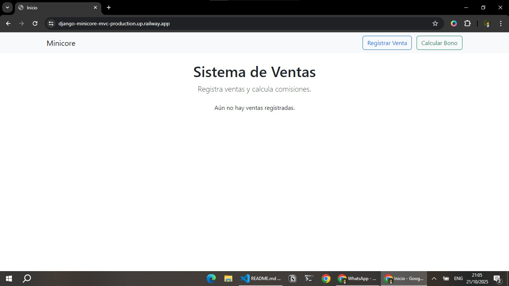
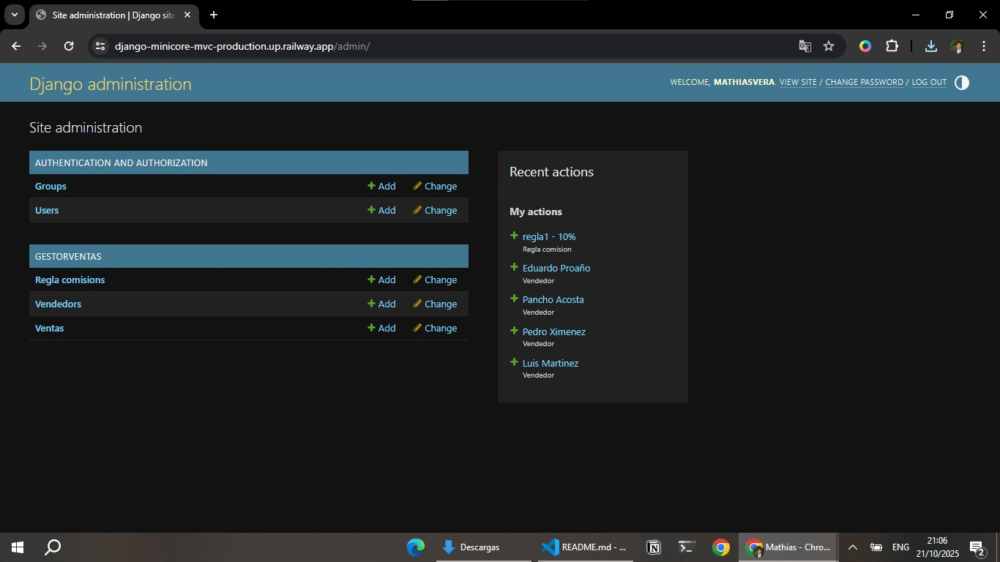

# Django Minicore - Sistema de Ventas

## Link de Produccion
https://django-minicore-mvc-production.up.railway.app

## Descripción

Este proyecto es un sistema de ventas desarrollado en Django, con interfaz basada en templates, desplegado en Railway.  
Permite:

- Registrar ventas.
- Gestionar vendedores.
- Definir reglas de comisión.
- Visualizar ventas registradas en el índice.
- Administrar el sistema mediante el panel de Django.

El servidor en si está desplegado en Railway, y cuenta con una base de datos PostgreSQL.

---

## Tecnologías

- Python 3.13
- Django 5.2.x
- SQLite (por defecto para desarrollo y deployment rápido)
- Bootstrap 5 (en los templates)
- Whitenoise (para servir archivos estáticos en producción)
- Railway (para despliegue rápido)

---

## Estructura de rutas clave

- `/` → Página principal con listado de ventas y botones a otras rutas.
- `/admin/` → Panel de administración de Django (vendedores, reglas de comisión, ventas).
- `/registrar/` → Sirve para registrar una nueva venta.
- `/calcular-bono/` → Sirve para hacer el calculo de un bono, basado en la regla establecida por el admin


---

## Instalación local (desarrollo)

1. Clonar el repositorio
```bash
git clone https://github.com/TU_USUARIO/django-minicore-mvc.git
cd django-minicore-mvc
```

2. Crear entorno virtual y activarlo
```bash
python -m venv venv
# Windows
venv\Scripts\activate
# Linux / Mac
source venv/bin/activate
```

3. Instalar dependencias
```bash
pip install -r requirements.txt
```

4. Configurar variables de entorno en `.env` (opcional, solo para SECRET_KEY y DEBUG) -> en desarrollo
```bash
SECRET_KEY=clave_secreta
DEBUG=True
```

5. Ejecutar migraciones y crear archivos estáticos -> desarrollo
```bash
python manage.py migrate
python manage.py collectstatic --noinput
```

6. Crear superusuario para acceder al panel de admin
```bash
python manage.py createsuperuser
```

7. Ejecutar el servidor de desarrollo
```bash
python manage.py runserver
```

- Accede a la app en `http://127.0.0.1:8000/`.
- Admin en `http://127.0.0.1:8000/admin/`.

---

## Despliegue en Railway por defecto viene con SQLite pero al volver a hacer deploy se eliminan los datos

1. Subir tu proyecto a GitHub.  
2. Crear un proyecto en Railway y conectarlo al repositorio.  
3. Procfile ya tiene configurado los comandos iniciales
4. Configurar variables de entorno en Railway, conectar con la base de datos de PostgreSQL
5. Desplegar la app, se hace automaticamente
7. La app estará accesible en el enlace que Railway genera.

---

## Imagenes del sistema en funcionamiento
1. Index del sistema.  

2. Creacion de venta.

3. Calculo de bono

4. Administrador de Django.


---

## Notas

- Todos los archivos estáticos se sirven desde `/staticfiles` gracias a Whitenoise.
- Configurar los Allowed Host correctamente, el normal y el CSRF, en settings.py

---

## Licencia

Este proyecto es de uso educativo y puede ser modificado libremente para fines de aprendizaje.


